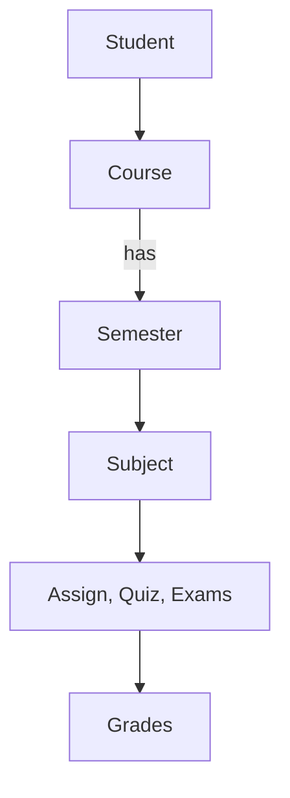

# Data

> [!NOTE]
> We will need to read multiple files of schemas, structures and actual data that is linked of subjects, grades (total/obtained) of assignment, quiz, exam, their weigtage, credit hours to get... 
> The end goal is - find CGPA, SCGPA, percentages of grade of subject, semester, individually of a student and collectively as well.


The main problem is finding out what files there should be, their format, how they are linked first of all before worrying about reading by program and all the latter stuff.


Basic structure that i can think of...



This will explain how the files are connected and what each file is for and what each does.


For now, these are the files,

```text
├── DATA.md
├── grade-policy.txt
├── students.txt
├── sub-grades.txt
└── subjects.txt
```

## What Each File has | does?

### `grade-policy.txt`

defines the schema of the grade like with lab/nolab, component, quantity, weightable - schema of a subject.

We have defined the max quantity of task, its weightage. and variation b/w weigtage/quantity in modes (lab/no-lab).

### `subjects.txt`

defines all subjects of a semester (n), unique-code, with name, credit hours
defines subjects of a semester (lab/no-lab)... linked with:

#### `grade-policy.txt`

subject having lab/nolab and its weightage in assignment, quiz, exam.

#### `sub-grades`

holds the actual data of students in individual assignment,quiz, exam.

### `students.txt`

holds basic student info


